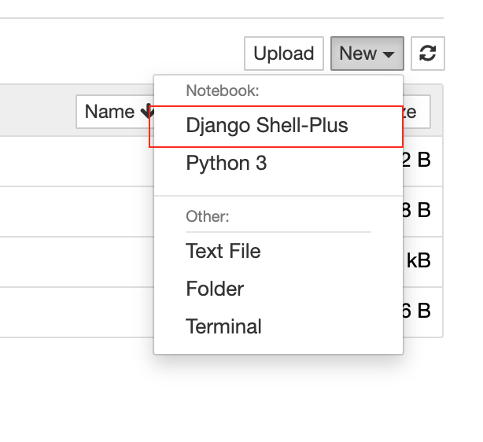
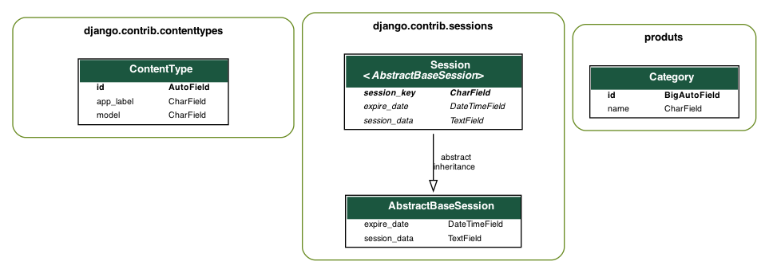

# 1. django shell 사용
## 필요한 패키지 설치
```bash
pip install ipython
```
## django shell 접속
 ```bash
 python manage.py shell
 ```


# 2. 주피터 노트북을 이용하기
## 필요한 패키지 설치
```bash
pip install django-extensions ipython notebook
```

## INSTALLED_APPS에  `django_extensions` 추가
```python
INSTALLED_APPS = [...., 'django_extensions',]
```

## 주피터 노트북 실행

### 아래 명령어를 통해서 주피터 노트북 시작
```bash
python manage.py shell_plus --notebook
```

### 주피터 노트북에서 `Django Shell_plus`를 선택


## Trouble shooting
### SynchronousOnlyOperation: You cannot call this from an async context - use a thread or sync_to_async.
settings.py에 아래 코드 추가
```python
import os
...
...
os.environ["DJANGO_ALLOW_ASYNC_UNSAFE"] = "true"
```

# 3. 관계도를 그래프로 출력
아래와 같이 django프로젝트의 모델? 간의 관계를 나타내주는 기능


## 패키지 설치
```bash
brew install graphviz
pip install django-extensions
pip install --install-option="--include-path=/usr/local/include/" --install-option="--libary-path=/usr/local/lib/" pygraphviz
```

## sttings.py 파일 수정
```python
INSTALLED_APPS = [...., 'django_extensions',]

GRAPH_MODELS = {
    'all_applications' : True,
    'group_models' : True,
}
```

## 그래프 생성
```bash
python manage.py graph_models -a -g -o [파일이름].png
```
세부사항은 아래링크 참조
>[django-extensions - Graph models](https://django-extensions.readthedocs.io/en/latest/graph_models.html)


