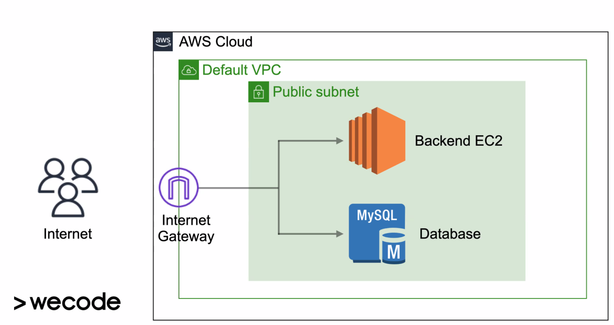
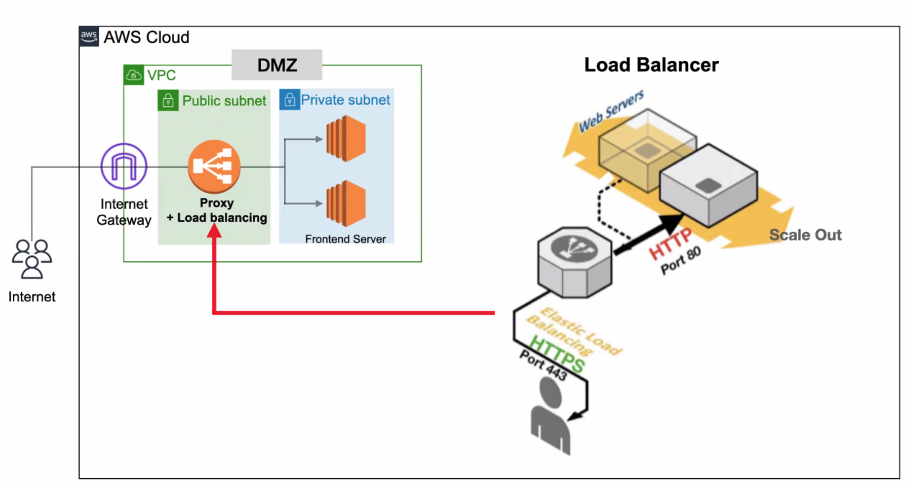

# Cloud computing
1. IT 리소스를 인터넷을 통행 on-demand(필요할 때)로 제공해주는 서비스를 말한다.
2. Colud 서비스를 **이용하면** 사용한만큼만 지불하면 되는 pay-as-you-go pricing 이 적용된다.
3. 정확하게 필요한 타입과 크기의 리소스를 지정하여 사용할 수 있다.
4. 필요한만큼의 리소스를 바로 사용 가능하다.
5. 기존볻 간변하게 서버, 스토리지, 데이터베이스 등에 접근가능한 솔수션을 제공한다.

## AWS 서비스

1. EC2 - 몇 분안에 구동 가능한 가상 서버
2. VPC - AWS 네트워크 망안의 사용자 전용의 사설 네트워크 망(생성하면 public subnet이 생성됨)
3. S3 - 파일 업로드 및 공유
4. RDS - 클라우드에서 데이터베이스 관리
5. ELB - 서버에서 들어오는 트래픽을 골고루 여러개의 머신으로 전달, 프록시(경로 설정 - https 요청으로만 받을 수 있게 할 수 있음)

프론트 - EC2에 배포 VPC 설정
백엔드 - EC2에 배포 및 RDS 에 배포 VPC설정

## 기본 실습


## 어드밴스


# E2C 설정

## 콘다설치
sudo apt-get update
sudo apt-get upgrade
sudo apt-get install gcc libmysqlclient-dev

## 콘다가상환경 만들기
conda create -n [project명] python=3.8
conda activate [project명]

## git 프로젝트 클론
python 패키지 설치
```bash
pip install -r requirements.txt
```
## public ip 설정
퍼블릭 IPv4 주소를 이용해서 sttings.py에 ALLOWED_HOSTS를 다음과 같이 수정

```python
ALLOWED_HOSTS = ['*', 'ip주소', 'ip주소:8000']

my_settings.py 설정

        'ENGINE': 'django.db.backends.mysql',
        'NAME': 'kakao',
        'USER': 'root',
        'PASSWORD': '',
        'HOST': rds end-point 주소,
        'PORT': '3306',
```

## 서버 실행
runserver 는 단일 스레드에서 작동하므로 멀티쓰레드를 지원하는 구니콘으로 바꿔서 적용하도록 한다.

```bash
pip install gunicorn
```
nohup을 사용해서 구니콘을 백그라운드에서 실행
```bash
nohup gunicorn --bind=0.0.0.0:8000 프로젝트명.wsgi &
```

# RDS 생성

## 기본 설정
1. 파라미터 그룹 생성 - 설정값
2. 파라미터 그룹 패밀리 - mysql8.0
3. 그룹 이름 - 아무거나 상관없음
4. 생성된 파라미터 그룹 들어가서 character_set 로 검색후 모든 값을 utf8mb4
5. collation_server, collation_connection 검색해서  utf8mb4_general_ci 로 세팅

## DB 테이블 구성
로컬 db에 내용을 덤프
```bash
mysqldump -u root -p [db명] > [파일명].sql
```
원격 db에 내용 넣기
마이그레이션 테이블 내용도 복사하기 때문에, 따로 마이그레이션을 하지 않아도 됨
```bash
mysql -h [호스트명] -uroot -p dkrlrhaWkd23! < [파일명].sql
```

# 더 하고 싶은 설정
1. gunicorn으로 서버 구동시, runserver 처럼 어떠한 요청이 들어왔는지 로그가 찍히면 좋겠음.